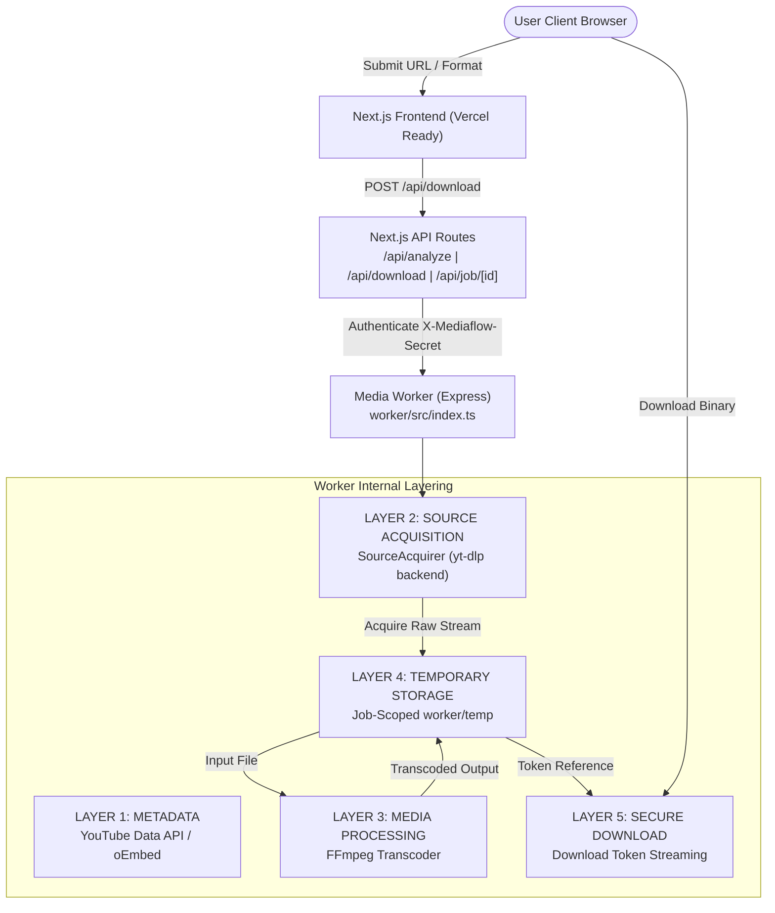

# MEDIAFLOW — Editorial Media Transcoder & Downloader (CON 05 Integration)

MEDIAFLOW is a production-oriented web application and visual system for processing authorized media from supported public platforms (YouTube and Instagram Reels).

Built with Next.js 14 App Router, TypeScript, Tailwind CSS, and a dedicated Express/FFmpeg Media Processing Worker with yt-dlp Source Acquisition, MEDIAFLOW features an editorial SaaS design language: soft warm backgrounds, a pale green hero container, elegant typography, high-contrast dark controls, and responsive asymmetric layouts.

---

## 🏛️ System Architecture & Layer Separation (CON 05)



### Key Architectural Characteristics
- **Layer 1 — Metadata**: Metadata retrieval (YouTube Data API / oEmbed) is kept separate from media stream fetching and transcoding.
- **Layer 2 — Source Acquisition (`SourceAcquirer`)**: Safe invocation of `yt-dlp` using Node `spawn` with array arguments, fixed internal flags, timeout controls, and `MAX_INPUT_MB` size enforcement. Never uses shell execution (`exec`) or string concatenation.
- **Layer 3 — Media Processing (FFmpeg)**: Dedicated media conversion for requested formats (`mp4`, `mp3`, `m4a`) and target resolutions without upscaling.
- **Layer 4 — Temporary Storage**: Ephemeral job-scoped directory (`worker/temp/<job-id>/`) with automatic cleanup.
- **Layer 5 — Secure Download**: Binary streaming via single-use, time-bounded download tokens.

---

## 🎞️ Supported Formats & Quality Specifications

### Video Output
- **Container Format**: `MP4` (`video/mp4`)
- **Video Codec**: `H.264` (`libx264`) with faststart flags (`-movflags +faststart`)
- **Audio Codec**: `AAC` (`aac`, 128k - 192k)
- **Supported Target Qualities**:
  - `best` — Native available source resolution
  - `1080p` — Full HD 1920x1080 max target (`scale=w=min(iw\,1920):h=-2`)
  - `720p` — HD 1280x720 max target (`scale=w=min(iw\,1280):h=-2`)
  - `480p` — Standard 854x480 max target (`scale=w=min(iw\,854):h=-2`)
  - `360p` — Mobile 640x360 max target (`scale=w=min(iw\,640):h=-2`)

### Audio Output
- **MP3 Container** (`audio/mpeg`): `libmp3lame` encoder
  - Qualities: `best` (320k), `320k`, `256k`, `192k`, `128k`
- **M4A Container** (`audio/mp4`): `AAC` encoder
  - Qualities: `best` (256k), `256k`, `192k`, `128k`

### No-Upscaling & Quality Selection Policy
- Quality matching policy: `requested quality` -> `exact match if available` -> `highest available below requested` -> `best compatible lower quality`.
- Lower source resolutions are **never upscaled** or relabeled as higher resolutions. `actualQuality` is reported honestly in job progress records.

---

## 🔒 Security & Source Acquisition Policy

1. **No Cookies & No Login Credentials**: MEDIAFLOW operates strictly without user cookies, browser session extraction, or account credentials.
2. **No Anti-Bot / Proxy Evasion**: No proxy rotation, captcha bypass, or fingerprint spoofing. If a source requires authentication or restricts access, an honest `AUTHENTICATION_REQUIRED` or `SOURCE_UNAVAILABLE` error is returned.
3. **Safe Process Invocation**: All `yt-dlp` and `FFmpeg` processes are spawned with validated array arguments and `--` option separators to prevent argument injection.
4. **SSRF Safeguards**: Protocol checks (`http:`, `https:`) and internal IP blocking (`127.0.0.1`, `10.x.x.x`, `169.254.x.x`, `192.168.x.x`).
5. **Path Traversal Protection & Filename Sanitization**: Internal job paths are generated strictly inside `worker/temp`. Output filenames are sanitized to strip illegal characters and path separators.
6. **Timeouts & Resource Limits**:
   - `SOURCE_ACQUISITION_TIMEOUT_SECONDS` (default: 120s)
   - `MAX_INPUT_MB` (default: 500 MB)
   - `MAX_OUTPUT_MB` (default: 500 MB)
   - Automatic child process termination (`SIGKILL`) on job failure, timeout, or cancellation.

---

## 🛠️ Local Development & Worker Setup

### 1. Prerequisites
- Node.js 18.x or 20.x+
- FFmpeg installed and available on system `PATH`
- `yt-dlp` installed and available on system `PATH` (or specified via `YT_DLP_PATH`)

### 2. Installing yt-dlp & FFmpeg on Windows / Linux
```bash
# Windows / Linux via pip
pip install yt-dlp

# Or on Windows via winget / choco
winget install yt-dlp
winget install Gyan.FFmpeg
```

### 3. Worker Administrator yt-dlp Update Guide
To update `yt-dlp` on the media worker server:
```bash
# via pip
pip install -U yt-dlp

# via standalone executable
yt-dlp -U
```
*Note: The worker does NOT attempt automatic self-updating during user request processing.*

### 4. Running Worker & Next.js App
```bash
# Start Media Worker Service
npm run worker

# In a separate terminal, start Next.js dev server
npm run dev
```

### 5. Running Automated Integration Tests
```bash
# Run worker processing, source acquisition, & security test suite
npm run test:worker
```

---

## 🌐 Production Environment & Container Configuration

### Required Production Environment Variables
Configure these variables in your long-running container environment (Render / Docker):

| Variable | Required | Description | Example |
|---|---|---|---|
| `PORT` | Yes | HTTP listening port supplied by container host | `3001` or provided by platform |
| `HOST` | Yes | Bind address for container networking (Must be `0.0.0.0`) | `0.0.0.0` |
| `MEDIA_WORKER_SECRET` | Yes | Shared authentication secret for server-to-server calls | Strong random secret string |
| `SOURCE_ACQUISITION_TIMEOUT_SECONDS` | No | Timeout limit for source downloads (Default: 120) | `120` |
| `PROCESSING_TIMEOUT_SECONDS` | No | Timeout limit for FFmpeg transcoding (Default: 300) | `300` |
| `MAX_INPUT_MB` | No | Maximum allowed input source file size in MB (Default: 500) | `500` |
| `MAX_OUTPUT_MB` | No | Maximum allowed output transcoded file size in MB (Default: 500) | `500` |
| `TEMP_FILE_TTL_SECONDS` | No | Time-to-live before temporary files are purged (Default: 3600) | `3600` |

> [!CAUTION]
> Never expose `MEDIA_WORKER_SECRET` in client-side code or `NEXT_PUBLIC_` environment variables.

### Health Endpoint
The worker provides an un-authenticated, safe operational health check:
- **Path**: `GET /health` (or `GET /api/v1/health`)
- **Response Format**:
  ```json
  {
    "status": "ok",
    "workerVersion": "1.0.0",
    "ffmpegAvailable": true,
    "ytDlpAvailable": true,
    "ytDlpVersion": "2024.12.23",
    "timestamp": "2026-09-26T09:40:00.000Z"
  }
  ```
- **Security Guarantee**: Does NOT expose environment variables, secrets, filesystem paths, internal IPs, or credentials.

### Temporary Storage Architecture
- Transcoded output files and active source acquisitions are stored in `worker/temp`.
- Periodic background cleanup task runs automatically to delete temporary files exceeding `TEMP_FILE_TTL_SECONDS`.

---

## 🚀 RENDER WORKER DEPLOYMENT

Follow these steps to deploy the MediaFlow Worker as a standalone Web Service on Render:

1. **Service Type**: Choose **Web Service**.
2. **Runtime**: Select **Docker**.
3. **Dockerfile Path**: `./Dockerfile` (located at repository root).
4. **Environment Variables**:
   - `MEDIA_WORKER_SECRET` = `<your-generated-shared-secret>`
   - `NODE_ENV` = `production`
   - `PORT` = (Render automatically injects `PORT`; worker listens on `0.0.0.0:$PORT`).
5. **Health Check Path**: `/health`
6. **Instance Scaling Limitation**:
   > [!IMPORTANT]
   > **V1 Architecture In-Memory Limitation**: The worker uses an in-memory job registry and local temporary disk storage for active transcode state. You MUST deploy **exactly 1 worker instance** (`1 Instance / No Multi-Replica`). Enabling multiple replicas will cause HTTP 404 errors during status polling if requests hit a replica that did not initiate the job.
7. **Connecting Vercel to Render**:
   - Once deployed on Render, copy your service's HTTPS URL (e.g. `https://mediaflow-worker.onrender.com`).
   - In your Vercel Project Settings (Environment Variables), set:
     - `MEDIA_WORKER_URL` = `https://mediaflow-worker.onrender.com`
     - `MEDIA_WORKER_SECRET` = `<same-shared-secret-as-render>`

---

## ⚡ VERCEL CONFIGURATION (NEXT.JS FRONTEND)

Set the following server-side environment variables in Vercel:

| Variable | Environment | Description |
|---|---|---|
| `MEDIA_WORKER_URL` | Production / Preview | HTTPS base URL of deployed Media Worker service |
| `MEDIA_WORKER_SECRET` | Production / Preview | Shared secret matching worker's `MEDIA_WORKER_SECRET` |
| `YOUTUBE_API_KEY` | Production / Preview | (Optional) YouTube Data API v3 key for server metadata |

> [!NOTE]
> All worker requests are dispatched server-side via Next.js API routes (`app/api/analyze`, `app/api/job`, `app/api/download`). The browser never directly contacts the worker or sees `MEDIA_WORKER_SECRET`.

---

## 🧠 IN-MEMORY JOB REGISTRY LIMITATIONS

The MediaFlow V1 Worker manages job status and progress using an in-memory `Map<string, JobRecord>`.

- **Single Instance Constraint**: Worker MUST run as a single container instance.
- **Worker Restarts**: Restarting or re-deploying the worker process clears all in-memory jobs and temporary files. Pending or in-flight jobs will need to be re-submitted.
- **No Redis / External DB**: No Redis or relational database is required or introduced in V1.

---

## ⚖️ Authorized Use Notice

MEDIAFLOW is intended strictly for media the user owns or has explicit authorization to download. It does not bypass DRM, paywalls, or platform access controls.

