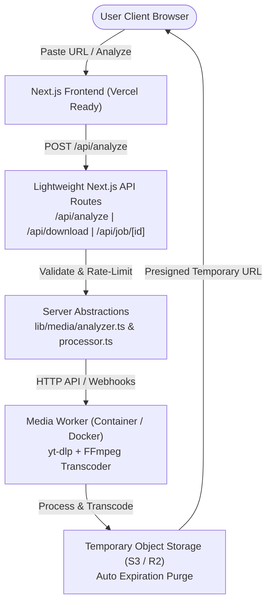

# MEDIAFLOW — Editorial Media Transcoder & Downloader (CON 01)

MEDIAFLOW is a production-oriented web application and visual system for processing authorized media from supported public platforms (YouTube and Instagram Reels).

Built with Next.js 14 App Router, TypeScript, and Tailwind CSS, MEDIAFLOW features an editorial SaaS design language: soft warm backgrounds, a pale green hero container, elegant typography, high-contrast dark controls, and responsive asymmetric layouts.

---

## 🏛️ System Architecture



### Why No Database is Used in V1
> **V1 does not require a database because the application has no user accounts and no persistent user history.**
>
> Media processing is ephemeral. If user accounts, download histories, API keys, or subscriptions are required in future milestones, PostgreSQL can be introduced without modifying the core media abstraction.

---

## 🎨 Visual System & Design Language

Inspired by editorial SaaS interfaces:
- **Background**: Soft warm off-white (`#F9F8F6`)
- **Hero Section**: Light pale green (`#E6F0E9`) with large rounded corners (`2.5rem`)
- **Typography**: Editorial serif headers paired with crisp sans-serif UI typography (`Inter`)
- **Primary Buttons**: High-contrast black buttons (`#000000`) with smooth hover interactions
- **Responsive Layout**: 2-column media preview layout on desktop (`1024px+`), single-column stacked layout on mobile screens (`320px` to `768px`).

---

## 🔒 Security Foundations

1. **Strict SSRF Protection**: Standardized domain whitelist (`youtube.com`, `youtu.be`, `instagram.com`), protocol enforcement (`https:`), and blocking of loopback/internal IPv4 & IPv6 ranges (`127.0.0.1`, `10.x.x.x`, `192.168.x.x`, etc.).
2. **URL Normalization**: Sanitizes tracking query parameters (`utm_*`, `fbclid`) while extracting verified media identifiers.
3. **Parameter Validation**: Server-side validation of media type (`video` | `audio`), container format (`mp4`, `mp3`, `m4a`), and quality parameters (`1080p`, `720p`, `320kbps`, etc.).
4. **No Arbitrary Shell Execution**: Next.js API routes never interpolate user input into shell commands (`child_process.exec`). Media operations are safely routed via typed JSON payload contracts to an isolated worker backend.
5. **Rate Limiting**: Sliding window rate-limiting per client IP address.

---

## 🛠️ Getting Started

### Prerequisites
- Node.js 18.x or 20.x+
- npm 9.x+

### Local Installation
```bash
# Install dependencies
npm install

# Start development server
npm run dev
```

Open [http://localhost:3000](http://localhost:3000) in your browser.

---

## ⚙️ Environment Variables

Copy `.env.example` to `.env.local`:

```bash
cp .env.example .env.local
```

Key configuration variables:
- `MEDIA_WORKER_URL`: Endpoint of the external FFmpeg worker service (e.g. `https://worker.mediaflow.internal`).
- `MEDIA_WORKER_SECRET`: Shared secret header (`X-Mediaflow-Secret`) for authenticating worker requests.
- `MEDIA_STORAGE_ENDPOINT`: Temporary storage provider URL.

*Note for CON 01: If `MEDIA_WORKER_URL` is omitted, the application operates in Architecture Mode—validating URLs, displaying metadata options, and cleanly reporting that background FFmpeg workers are offline.*

---

## 🚀 Deployment

### Frontend (Vercel)
The Next.js App Router application is optimized for Vercel deployment:
- Zero state serverless API routes.
- Low-latency static rendering for visual landing pages.

### Media Processing Worker (CON 02 Deployment)
Heavy FFmpeg video encoding must run on a dedicated worker environment (e.g. AWS ECS, Fly.io, Railway, or Kubernetes Docker container with `yt-dlp` and `ffmpeg` pre-installed).

---

## ⚖️ Authorized Use Notice

MEDIAFLOW is designed for processing media that the user owns, has explicit permission to download, or is otherwise legally authorized to process. The system strictly enforces platform security boundaries and does not bypass private account restrictions, DRM, or access controls.
